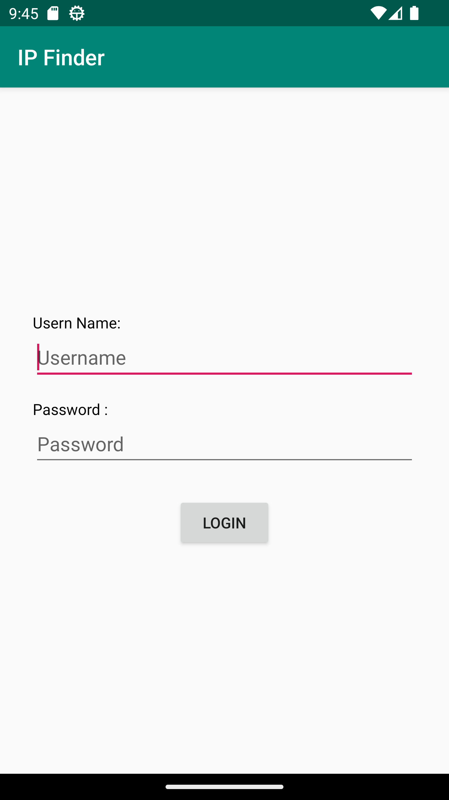

# Examen_Android
### Partie Login
*nom d'utilisateur*: **admin**
*password* : **admin**

capture d'ecran du page login

### Rechrche d'une IP addresse

### Resultat de la recherche d'une IP addresse

